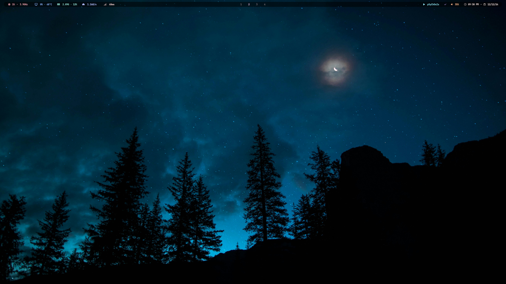

<br>



A sleek and minimalist desktop setup for Arch Linux powered by [Hyprland](https://github.com/hyprwm/Hyprland), optimized for performance, aesthetics, and productivity.

---

## 📦 Requirements

- A working Arch Linux installation
- Basic familiarity with the terminal and git

---

## 🛠️ Installation Guide

### 1. 🔐 Backup Your Current Configuration

```bash
mkdir -p ~/dotfiles-backup
cp -r ~/.config ~/dotfiles-backup/
```

---

### 2. 📥 Clone the Repository

```bash
git clone https://github.com/erffy/dots -b hypr
cd dots
```

---

### 3. 📦 Install Required Packages

Choose your AUR helper:

#### With pacman (only official packages):
```bash
sudo pacman -S --needed - < packages
```

#### With yay:
```bash
yay -S --needed - < packages
```

#### With paru:
```bash
paru -S --needed - < packages
```

---

### 4. 🗂 Copy Config Files

```bash
mkdir -p ~/.config ~/.local/share/applications
cp -rn .* ~/
```

> ✅ Use `-n` to skip overwriting existing files.
> ❗ Remove `-n` if you want to **force overwrite**:
> `cp -r .* ~/'

---

### 5. ⚙️ Set Permissions

```bash
chmod +x ~/.local/bin/* ~/.config/waybar/bin/*
```

---

### 6. 🔄 Reboot

```bash
reboot
```